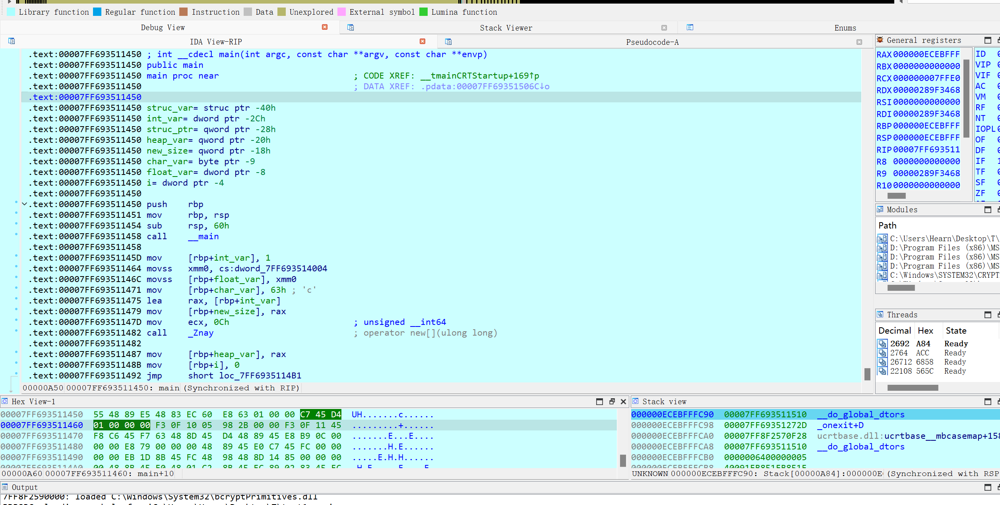

### VarViewer

IDA-VarViewer is a IDA plugin that implements two views for observing the variable definited in disassembly code and pseudocode. It will search for all variables in the function, get their values, transform to strings according to their type and display them in the view.


### Requirements

- IDA-Pro version >= 7.7
- IDApython version >= 3.8

Supports architectures: x86, x86-64 

### Install

Copy all files in `src/` directory  to IDA plugins directory


### Usage

- Use Hotkey `Shift+Ctrl+S` to open stack viewer
- Use Hotkey `Shift+Ctrl+V` to open variable viewer

stack viewer displays the variables defined in disassembly code in the form of a stack view. Additionally, it can identifying pointers on the stack, and add descriptions based on the addresses they point to.

Variable viewer displays the variables defined in the pseudocode in a tree structure. Each variable is divided into corresponding function blocks according to the function it belongs to.

> [!TIP]
> The data type to which the variable value is converted depends on the identification of variable type in pseudocode. So you may need to identify and modify the variable type in pseudocode view before using the plugin  


### Configuration

You can change the configuration of the plugin by changing the value defince in `src\VarViewer\config\py`, include hotkeys,viewer color and the size of the loading stack

### Screenshots

Test different types of variables:

```cpp
int main()
{
    int int_var = 1;
    float float_var = 2.1f;
    char char_var = 'c';
    int *ptr_var = &int_var;
    int * heap_var= new int[3];
    for(int i=0;i<3;i++){
        heap_var[i] = i;
    }
    struct struc{
        int j;
        char k;
        double l;
    };
    struc struc_var;
    struc_var.j = 5;
    struc_var.k = 'd';
    struc_var.l = 3.14;

    struc *struc_ptr = &struc_var;
    delete[] heap_var;
}
```

disassembly code:


pseudocode view:


stack viewer:


variable viewer:


